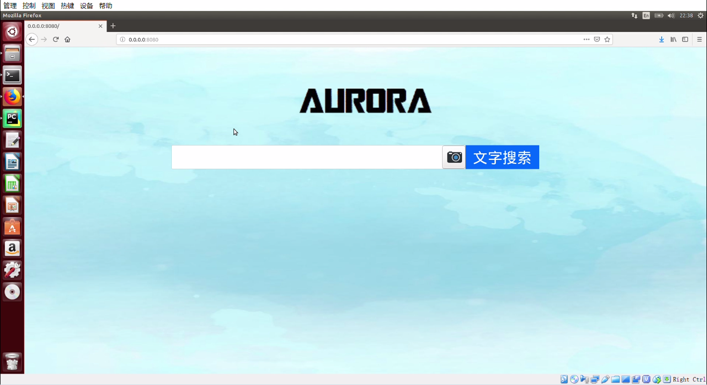
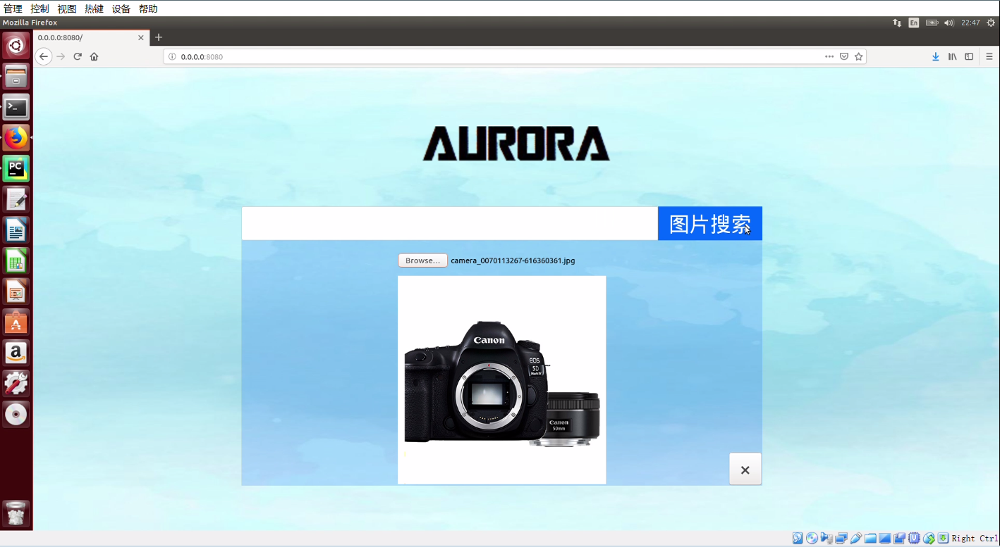
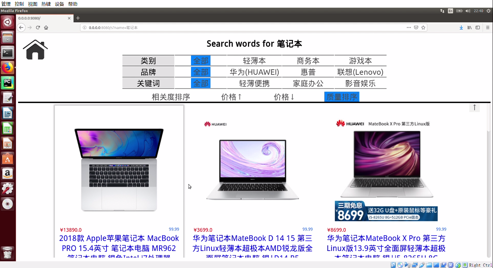

# Product Search Engine

Crawled data of products and built local search web pages which enabled users to conduct text and image searches. Built the web application framework in Python, and realized the front-end of website using HTML, CSS and JavaScript. Equipped the search engine with a high degree of matching for text search (the matching effect of picture search by mobile phones, computers or cameras was accurate and the search speed was completed in 0.1s)  

## Requirements

Python version 2.7

beautifulsoup4 version 4.8.1

PyLucene version 4.9.0

webpy version 0.37

jieba

torch version 1.3.1

pillow version 6.2.1

tqdm version 4.36.1

## Getting Started

```
python code.py
```

Then visit website http://localhost:8080/ use your browser.

## Preview

### Home Page-Search for words



### Home Page-Search for pictures



### Results Page



